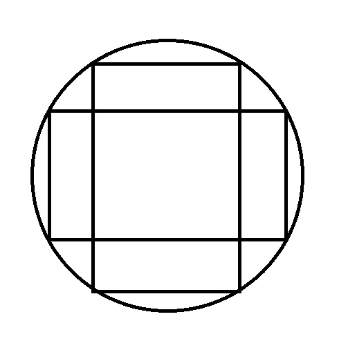
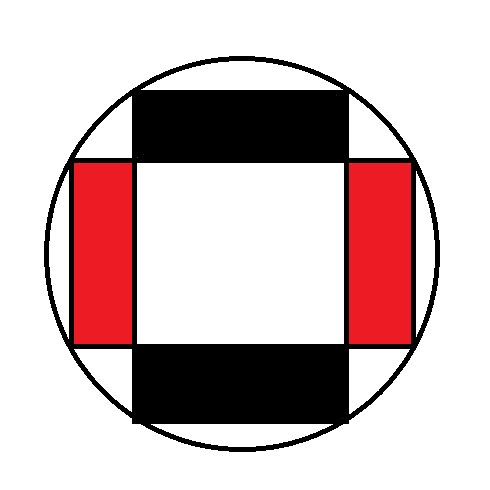
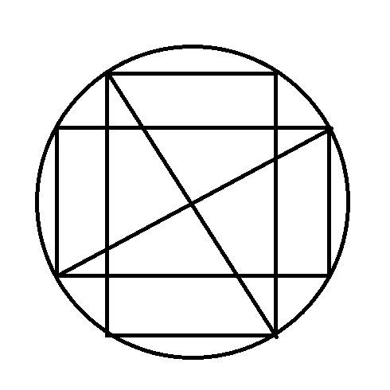
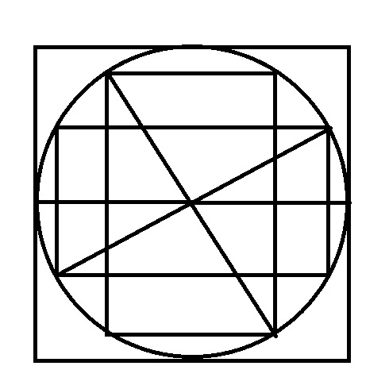
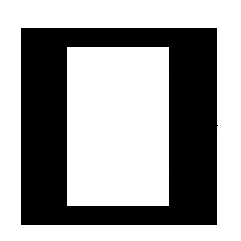
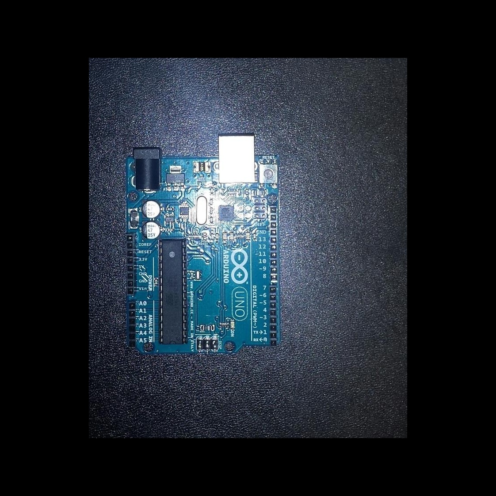
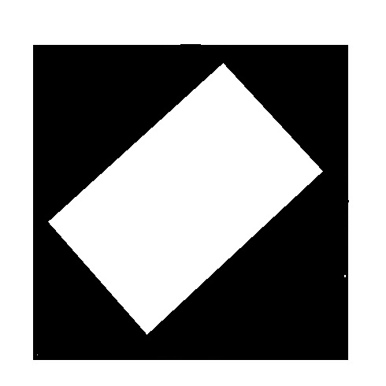
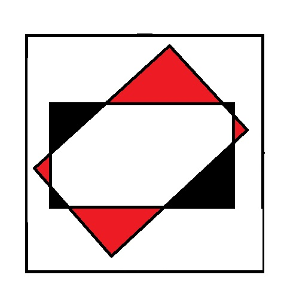
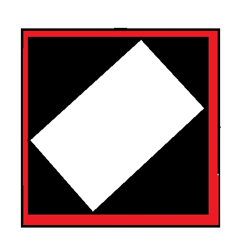
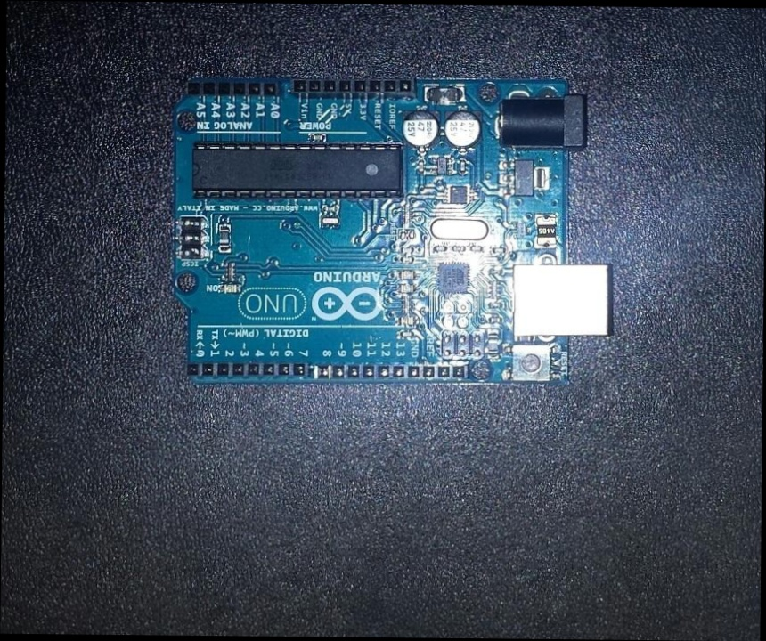

# Adding and Removing Borders

## Introduction

In the last blog, we sucessfully rotated image PCB2 so that the contents of it are aligned the same as the contents of image PCB1. At the end of the blog, we noticed that parts of the image were missing and there were unnecessary black bars at the top and bottom of the image. This blog will explore exactly why that happens and how to overcome it. 

## Addressing the Problem

When rotating an image around a centre point, the contents of the image get rotated but the dimensions of the image remain the same. In our case, we rotate our image roughly 90 degrees. Fig 1 shows the vertical rectangle (our image) rotating to become a horizontal image. However, because the dimenstions of our image have remained the same, we lose the sides of our image and parts of the window that no longer contain the image get filled in with black. Fig 2 shows the missing parts of the image in red and the added black bars in black.

| Fig 1 | Fig 2 |
| :---: | :---: |
|  |  | 

We need to constuct a window big enough for the image to rotate without any details falling off the edge. But how big? As Fig 3 shows, the longest the rectangle can be is the distance from one corner to its opposite corner: its diameter. This means that if we get the diameter of the image, we can make a square window with the image's diameter as the width and height (Fig 4) and place the image in the centre of this window.

| Fig 3 | Fig 4 |
| :---: | :---: |
|  |  |

The image is now free to rotate inside the window without anything getting clipped off. Fig 5 shows what we are now trying to create: the image will be the rectangle in white and the rest of the window will be black.

| Fig 5 |
| :---: |
|  |


## Getting the Diameter

First we need to get the diameter of the image. As the image is a rectangle with a right angle, we can say that the height and width of the images are sides of a right-angled triangle which would make the diameter the hypotenuse. Thus, we can find the diameter using the Pythagorean Theorem[1].

```python
def getDiameter(img):
    h, w = np.shape(img)[:2]
    hyp = (w*w + h*h)**(1/2)
    return(int(hyp)+1)
```  

## Adding Borders

Now that we can find the diameter, we can start our function to add borders to our image.

### Making the Background

Instead of actually adding borders to the image in question, we will make a new image that is all black with the dimensions of the diameter and then paste the image on top. To make the all black image, we make use of NumPy's .zeroes()[2] function. This makes an array with all elements set to zero (i.e. black). In the parameters, the diameter(hyp) is the width and height. The number 3 represents the number of channels. One for red, one for blue, one for green. 

```python
hyp = getDiameter(img)
mask = np.zeros((hyp, hyp, 3), np.uint8)
```

### Adding the Image

Finally, we need to place the original image on top of the new black image(mask) at the exact centre point. Start by getting the width, height, and centre point of both the original image and the mask. Use these values to select an area at the centre of the mask that is the size of the original image and replace this selection with the original image.

```python
y1, x1 = np.shape(mask)[:2]
cx = x1/2
cy = y1/2

y2, x2 = np.shape(img)[:2]
cx2 = x2/2
cy2 = y2/2 

mask[int(cy-cy2):int(cy+cy2) , int(cx-cx2):int(cx+cx2)] = img[0:y2, 0:x2]
```

### Completed Function

Below is the full addBorders() function that makes use of the code discussed above:

```python
def addBorders(img):
    hyp = getDiameter(img)
    mask = np.zeros((hyp, hyp, 3), np.uint8)

    y1, x1 = np.shape(mask)[:2]
    cx = x1/2
    cy = y1/2

    y2, x2 = np.shape(img)[:2]
    cx2 = x2/2
    cy2 = y2/2 

    mask[int(cy-cy2):int(cy+cy2) , int(cx-cx2):int(cx+cx2)] = img[0:y2, 0:x2]

    return(mask)

borderedImg = addBorders(pcb2)
```

### Result

As you can see below, we have successfully added borders to the image that are big enough to allow for rotation without losing any details:

| Bordered PCB 2 | Rotated PCB 2 |
| :---: | :---: |
|  |  | 


## Removing the Borders

Now that the image has been successfully rotated, we want to get rid of the extra black parts in order to make comparison easier. We cannot simply crop to the selection of the original image as the rotation may not have been exactly 90 degrees. That is to say, if the board in PCB1 was at 0 degrees, and the board in PCB 2 was at 45 (Fig 6), the rotated image will have angled edges so cropping to PCB1's dimensions will not work (Fig 7).

| Fig 6 | Fig 7 |
| :---: | :---: |
|  |  |

Instead, we will attempted to remove the excess black areas while keeping the whole rotated image. Fig 8 shows the goal result with clipped off excess borders in red.

| Fig 8 |
| :---: |
|  |

### Defining the Region of Interest

The goal of this function is to create a new rectangle containing the Region of Interest(ROI) from within the image and return that alone. We start by getting the width and height of the image in question. We then declare four variables, one for each edge of the region of interest: top, bottom, left, and right. We assign the highest possible value to left and top and the lowest possible value for right and bottom.

```python
h, w = np.shape(img)[:2]

left = w
right = 1
top = h
bottom = 1
``` 

### Looping Through the Image

Next we want to loop through every pixel in the image and check its value. To make it easier, we first convert the image to greyscale so we are checking one value instead of three:

```python
B = cv2.cvtColor(img, cv2.COLOR_BGR2GRAY)
```

Then we loop through the image. We check if the current pixel is greater than 0 (i.e. not black). If so, we check the location of the pixel. If the row of the pixel is less than the value in the top variable, that value replaces the current value in top. If the column of the pixel is higher that the value in right, that value replaces the current value in right etc. 

```python
for i in range (1, h):
    for j in range (1, w):
        if B[i,j] > 0:

            if i < top:
                top = i

            if i > bottom:
                bottom = i

            if j < left:
                left = j

            if j > right:
                right = j
```

We should now have four separate values for the ROI variables and we can extract the ROI by cropping to those dimensions:

```python
C = img[top:bottom, left:right]
```

### Final Code

Below is the full removeBorders() function that makes use of the code discussed above:

```python
def removeBorders(img):
    h, w = np.shape(img)[:2]

    B = cv2.cvtColor(img, cv2.COLOR_BGR2GRAY)

    left = w
    right = 1
    top = h
    bottom = 1

    for i in range (1, h):
        for j in range (1, w):
            if B[i,j] > 0:

                if i < top:
                    top = i

                if i > bottom:
                    bottom = i

                if j < left:
                    left = j

                if j > right:
                    right = j

    C = img[top:bottom, left:right]

    return C

```

### Result:

Below, we can see the rotated PCB2 image with its borders removed in comparison to the original PCB1 image:

| PCB1 | Removed Borders |
| :---: | :---: |
|  |  | 

## References

[1] 'The Pythagorean Theorem', [Online]. Available: http://www.montereyinstitute.org/courses/DevelopmentalMath/COURSE_TEXT2_RESOURCE/U07_L1_T4_text_final.html. [Accessed: 2017-7-6]

[2] 'numpy.zeroes', [Online]. Available: https://docs.scipy.org/doc/numpy-1.13.0/reference/generated/numpy.zeros.html. [Accessed: 2017-7-6]