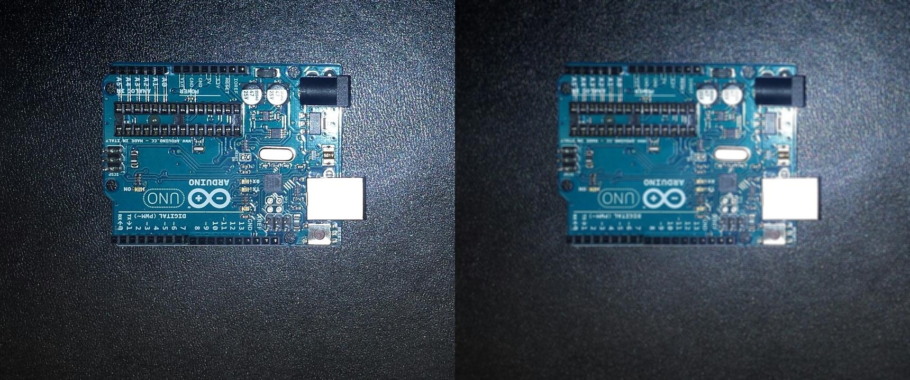
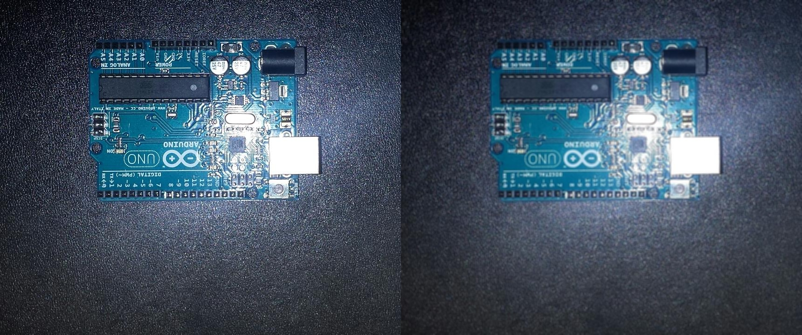
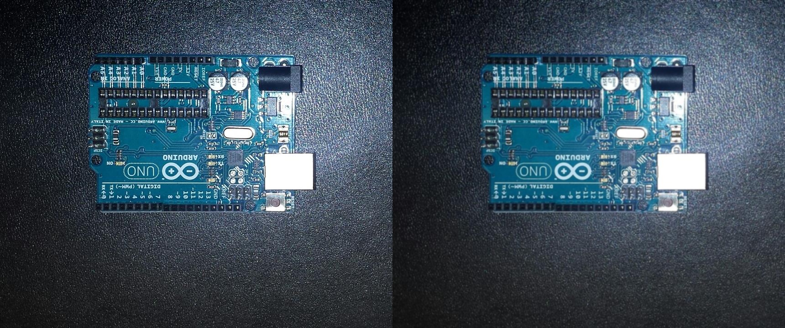
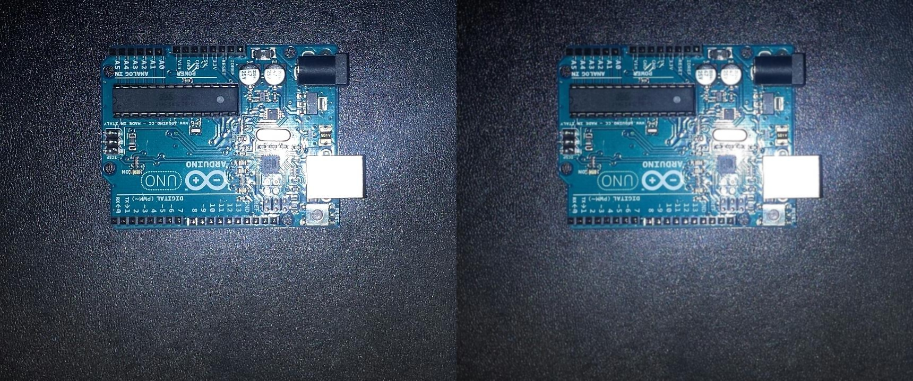

# Cleaning the Image
To a human eye, the two images with which we are working are almost identical. Both images show the same Arduino on the same surface and in roughly the same position, with the exception of the missing microprocessor in the first image. However, to a computer, the two images look very different. This is because the flash of the camera that took both pictures created a lot of noise.

In order to find the human-visable differences in the image, we will first have to find a way to smooth both images and reduce the noise. This blog entry will document the attempts researched.

## 2D Convolution [1]

This method makes use of a Low Pass Filter through the OpenCV function cv2.filter2D(). This function convolves a kernel with an image. We will use the following kernel:

|1  1  1  1  1|

|1  1  1  1  1|

|1  1  1  1  1| K = 1/25	

|1  1  1  1  1|

|1  1  1  1  1|

The function will place the kernel over a square of 25 pixels and get the average value for all pixels in the square. It then assigns this value to the pixel in the center of the kernel. It repeats this process for all pixels.

| PCB1 |
| :---: |
|  |


| PCB2 |
| :---: |
|  |


### Code
```python
def convolution2D(img):
   
  kernel = np.ones((5,5),np.float32)/25
  dst = cv2.filter2D(img,-1,kernel)


  imgs = np.hstack((img, dst))

  cv2.imshow(window, imgs)
  cv2.imwrite(outputPath + window + fileExtension, imgs)

convolution2D(pcb1, "convolution1")
convolution2D(pcb2, "convolution2")
```

## Image Blurring [1]
2D Convolultion introduces the idea of blurring an image using kernels. There are some pre-written image blurring functions in OpenCV based off of this idea. We will test them out here with a 5x5 kernel.

### Averaging
Averaging makes use of a normalized box filter, i.e. all elements are set to 1. This method takes the average of all pixels within the kernel and assigns the result to the kernel's central pixel. Very similar to the previous example execept we can do it in one line this time.

| PCB1 |
| :---: |
|  |

| PCB2 |
| :---: |
| |

### Code
```python
def averaging(img, window):

  blur = cv2.blur(img,(5,5))
   
  imgs = np.hstack((img, blur))

  cv2.imshow(window, imgs)
  cv2.imwrite(outputPath + window + fileExtension, imgs)

averaging(pcb1, "averaging1")
averaging(pcb2, "averaging2")
```

### Gaussian Blurring
Instead of a box filter, Gaussian Blurring uses a Gaussian kernel. This kernel contains small pixel values on the outside that get higher towards the centre. Similar to this example: 

|1  4  7  4  1|

|4  16 26 16 4|

|7  26 41 26 7| k=1/273

|4  16 26 16 4|

|1  4  7  4  1|

Using a kernel like this should help remove noise while maintaining the integrity of the image.

| PCB1 |
| :---: |
|  |

| PCB2 |
| :---: |
| |

### Code
```python
def gaussianBlur(img, window):
  blur = cv2.GaussianBlur(img,(5,5),0)

  imgs = np.hstack((img, blur))

  cv2.imshow(window, imgs)
  cv2.imwrite(outputPath + window + fileExtension, imgs)

gaussianBlur(pcb1, "gaussianBlur1")
gaussianBlur(pcb2, "gaussianBlur2")
```

### Bilateral Filtering
Bilateral Filtering aims fix the issues with Gaussian Blurring, specifically not caring if the pixel is a part of an edge or not. It uses a Gaussian kernel of space so it only compares nearby pixels, but it also makes use of a Gaussian function for intensity to ensure that only pixels of similar intensities are blurred, thus preserving edges. 

| PCB1 |
| :---: |
|  |

| PCB2 |
| :---: |
|  |

### Code
```python
def bilateralFilter(img, window):

  blur = cv2.bilateralFilter(img,9,75,75)

  imgs = np.hstack((img, blur))

  cv2.imshow(window, imgs)
  cv2.imwrite(outputPath + window + fileExtension, imgs)

bilateralFilter(pcb1, "bilateralFilter1")
bilateralFilter(pcb2, "bilateralFilter2")
```

## Denoising [2]
Image blurring works well for removing noise, however, OpenCV contains functions specifically for denoising which we will also explore

### Non-local Means Denoising
This is very advanced technique. It is done by finding small windows in the image that look similar, taking a pixel inside one of those windows, averaging all windows and replacing the selected pixel with the result of this averaging. 

| PCB1 |
| :---: |
|  |

| PCB2 |
| :---: |
|  |

### Code
```python
def fastN1MeansDenoising(img, window):

  dst = cv2.fastNlMeansDenoisingColored(img,None,10,10,7,21)

  imgs = np.hstack((img, dst))

  cv2.imshow(window, imgs)
  cv2.imwrite(outputPath + window + fileExtension, imgs)

fastN1MeansDenoising(pcb1, "Denoised1")
fastN1MeansDenoising(pcb2, "Denoised2")
```


## Choosing a technique
Non-local Means Denoising seems to be very effective so I have advised my team to continue using it. However, because it is so far advanced, it might be worth further exploring the inner workings of this function to see if there is elements that we can tweak in order to further aid us in our goal. Perhaps even combining this function with Bilateral Filtering to keep the edges in mind when denoising.

## References:
[1] 'Smoothing Images', 2014, [Online]. Available: https://docs.opencv.org/3.1.0/d4/d13/tutorial_py_filtering.html. [Accessed: 2017-10-27]

[2] 'Image Denoising', 2014, [Online]. Available: https://docs.opencv.org/3.2.0/d5/d69/tutorial_py_non_local_means.html. [Accessed: 2017-10-27]
