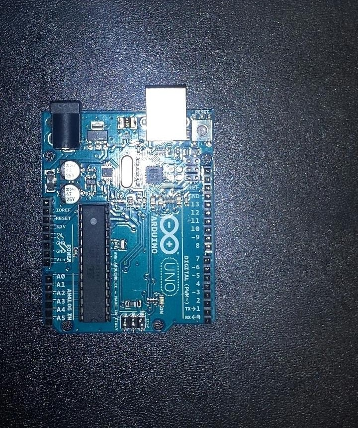
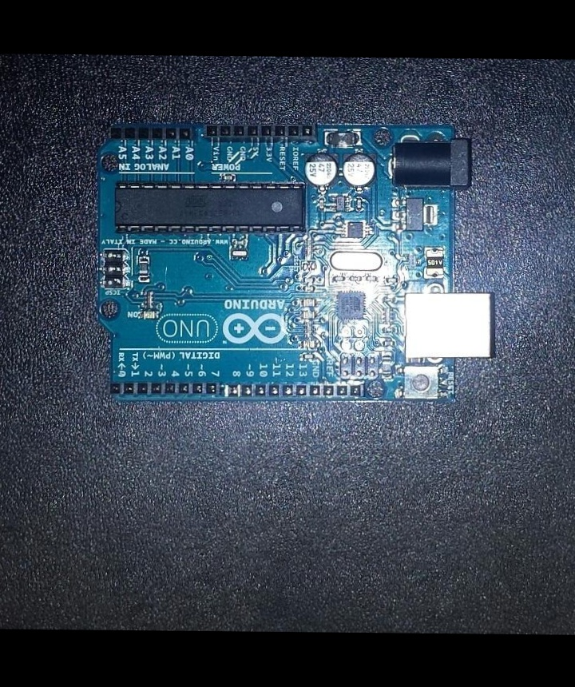

# Rotating the Image

We have gotten to the point where we can find matches between images. The next stage in our project should be template matching. However, template matching only works when the objects of interest, in our case, the PCB boards, are oriented in the same way. For example, if one PCB board is horizontal and the other is vertical, template matching will not work as the program will look for a template in the same area as the other image. 

The following blog will explore a solution to this problem by testing the program using the original pcb1.jpg image and a version of the pcb2.jpg rotated by 90 degrees. The goal of this test is to rotate the second PCB board to the same angle as the original one.

| PCB1 | PCB2 |
| :---: | :---: |
|  |  |

## Finding the Rotation Angle

Before we rotate, we need to figure out the angle of rotation. Let's explore that here.

### getMatches()

We will start by defining a Python function getRotationAngle() which takes one parameter, matches. This parameter should be the matches dictionary returned in the getMatches function defined by Vlad[1]. 

```python
def getMatches(img1, img2):
    akaze = cv2.AKAZE_create()
    kp1, desc1 = akaze.detectAndCompute(img1, None)
    kp2, desc2 = akaze.detectAndCompute(img2, None)

    bf = cv2.BFMatcher(normType = cv2.NORM_HAMMING, crossCheck = True)
    matches = bf.match(desc1, desc2)
    matches = sorted(matches, key = lambda match:match.distance)

    matchedCoordinates = []
    for match in matches:
        keyPoint1 = kp1[match.queryIdx]
        keyPoint2 = kp2[match.trainIdx]

        currentMatch = {
            'pt1': {
                'x': keyPoint1.pt[0],
                'y': keyPoint1.pt[1]
            },
            'pt2': {
                'x': keyPoint2.pt[0],
                'y': keyPoint2.pt[1]
            }
        }

        matchedCoordinates.append(currentMatch)

    return matchedCoordinates

matches = getMatches(pcb1, pcb2)
```

This function returns a dictionary full of similar points between both images. It is organized such that the best match is the first element in the dictonary, the second best match the second element, and so on. Because we have an ordered dictionary of matches, we can use the points of the two best matches to figure out the angle between them.

### Defining the Lines

By accessing the top two matches, we get four points: the coordinates for the top match in the first image, top match in the second image, second best match in the first image, and second best match in the second. We will assign the value for both the x and y coordinates for each point to variables like so:

```python
point1AX = matches[0]['pt1']['x']
point1AY = matches[0]['pt1']['y']
point2AX = matches[0]['pt2']['x']
point2AY = matches[0]['pt2']['y']

point1BX = matches[1]['pt1']['x']
point1BY = matches[1]['pt1']['y']
point2BX = matches[1]['pt2']['x']
point2BY = matches[1]['pt2']['y']
```

### Getting the Slope

Next, we will use these points to calculate the slope between the matches for both images. We do this using the mathematic formula for calculating slope[2].

```python
m1 = ((point1BY - point1AY) / (point1BX - point1AX))

m2 = ((point2BY - point2AY) / (point2BX - point2AX))
```


### Finding the Angle

Next, using the Atan function from the Math library[3], we can get the angle of each line compared to a common origin. Finally, we take the angle of Line 1 away from Line 2 to get the angle of rotation that we need. Before returning it, we convert it from radians to degrees.

```python
line1Angle = math.atan(m1)
line2Angle = math.atan(m2)

rotationAngle = line2Angle - line1Angle
rotationAngle = np.rad2deg(rotationAngle)
```

### Result

Below is the entire getRotationAngle() function using everything that has been discussed above:

```python
def getRotationAngle(matches):
    point1AX = matches[0]['pt1']['x']
    point1AY = matches[0]['pt1']['y']
    point2AX = matches[0]['pt2']['x']
    point2AY = matches[0]['pt2']['y']

    point1BX = matches[1]['pt1']['x']
    point1BY = matches[1]['pt1']['y']
    point2BX = matches[1]['pt2']['x']
    point2BY = matches[1]['pt2']['y']

    m1 = ((point1BY - point1AY) / (point1BX - point1AX))
    line1Angle = math.atan(m1)

    m2 = ((point2BY - point2AY) / (point2BX - point2AX))
    line2Angle = math.atan(m2)
    
    rotationAngle = line2Angle - line1Angle

    rotationAngle = np.rad2deg(rotationAngle)

    return(rotationAngle)


rotationAngle = getRotationAngle(matches)
```

## Rotating the Image

Now that we have a rotation angle, we can finally rotate the image. We start this process by defining the function rotateImage() which takes two parameters: the image to be rotated(img), and the angle of rotation (rotationAngle). 

### Setting up the Rotation

Inside the function, we first get the shape of the image using NumPy's .shape() method to get the height (y) and width (x) of the image. We also divide these values by 2 to get the image's centre coordinates (cx, cy).

### Applying the rotation

Finally, we apply the rotation by using OpenCV's getRotationMatrix2D() function to make a rotation matrix M. This takes 3 parameters: the centre point (cx,cy), the angle of rotation (rotationAngle), and the scale which we will leave as 1. We then use OpenCV's warpAffine() function to apply this rotation to the image. This function takes three parameters: the image to be rotated(img), the rotation matrix (M), and the width and height of the new rotated image. 

```python
def rotateImage(img, rotationAngle):
    y, x = np.shape(img)[:2]
    cx = x/2
    cy = y/2

    M = cv2.getRotationMatrix2D((cx,cy), rotationAngle, 1)
    R = cv2.warpAffine(img, M, (x, y))

    return R

R = rotateImage(borderedImg)
```

## Results

As you can see below, we have sucessfully rotated the second image so that both PCB boards are angled the same.

| PCB1 | Rotated PCB2 |
| :---: | :---: |
|  |  |

### Falling off the Edge?

The rotation works great. However, the dimensions of PCB2 have remained the same. This results in the black bars at the top and bottom of the image as well as the outer parts of the rotated section not being visible as the window is not wide enough. In the next blog, we will tackle how to avoid this and also how to scale the rotated image to ensure that it's exactly the same size as the pcb1 image. 

## References

[1] Vlad Zat, 'Comparing Descriptor Matching Algorithms and Options', 2017, [Online]. Available: https://vzat.github.io/comparing_images/week5.html. [Accessed: 2017-7-2]

[2] 'Calculating the Slope', [Online]. Available: http://cls.syr.edu/mathtuneup/grapha/Unit4/Unit4a.html. [Accessed: 2017-7-2]

[3] 'Trigonometric functions', [Online]. Available: https://docs.python.org/2/library/math.html#trigonometric-functions