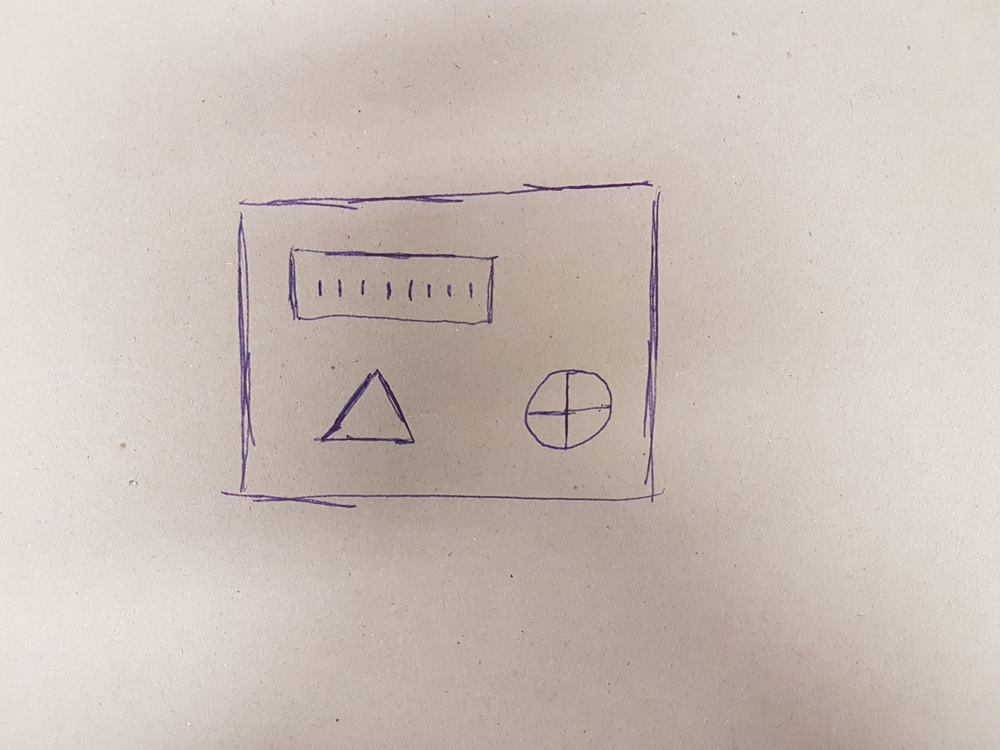

# Scaling the Image

## Introduction

Over the last two blogs, we have successfully rotated PCB2.jpg so that the pcb board in the image is at the same angle as the pcb board in PCB1.jpg. This means that we should be ready for template matching which will be used to notice the differences between the images. However, we have learned that this method only works to the desired effect when both pcb boards are the same size in each image. Because of this, as well as rotating, we also have to scale one of the images in such a way that both pcb boards are the same size. We will explore how to do so in this blog.

## Goal

To ensure we reach our goal, I have drawn a new PCB image and took a picture of it with my phone at two different distances. The goal is to write a function that returns two images, in which both pcb boards are the same size.

| PCB 1 | PCB 2 |
| :---: | :---: |
|  |  |  

## Get Scaling Level

First off we need to figure out by how much to scale the image. We will do this by getting the two best matches between the images, finding the distance between these points for both images and returning the smaller distance divided by the larger one. This function will take one parameter, matches, which will be the dictionary returned when calling our getMatches() function.

### Get Top Two Matches

We first get the X and Y coordinates for each of the four points in the top two matches and assign them to individual variables.

```python
# get (X,Y) for each point in top 2 matches
point1AX = matches[0]['pt1']['x']
point1AY = matches[0]['pt1']['y']
point2AX = matches[0]['pt2']['x']
point2AY = matches[0]['pt2']['y']

point1BX = matches[1]['pt1']['x']
point1BY = matches[1]['pt1']['y']
point2BX = matches[1]['pt2']['x']
point2BY = matches[1]['pt2']['y']
```

### Get Distance

Next we use our previously defined getDistance() function to get the distance between the two points from PCB1 and the distance between the two points in PCB2 and assign them to their respective variables

```python
# get distance between the top two matches
dist1 = getDistance(point1AX, point1AY, point1BX, point1BY)
dist2 = getDistance(point2AX, point2AY, point2BX, point2BY)
```

### Return the Scaling Level

Finally, we check to see which distance value is lower and return that value divided by the other other one. We do this so that when we scale, we're scaling the larger PCB board down to the smaller one to avoid losing any details. Note how we also return either a 1 or a 0. This is to the scaling function which image to scale.

```python
# return smaller distance divided by larger distance
if(dist1 < dist2):
    return ((dist1 / dist2), 0)
else:
    return ((dist2 / dist1), 1)
``` 

### Completed Function

Below is the full getScalingLevel() function that makes use of the code discussed above:

```python
def getScalingLevel(matches):
    # get (X,Y) for each point in top 2 matches
    point1AX = matches[0]['pt1']['x']
    point1AY = matches[0]['pt1']['y']
    point2AX = matches[0]['pt2']['x']
    point2AY = matches[0]['pt2']['y']

    point1BX = matches[1]['pt1']['x']
    point1BY = matches[1]['pt1']['y']
    point2BX = matches[1]['pt2']['x']
    point2BY = matches[1]['pt2']['y']

    # get distance between the top two matches
    dist1 = getDistance(point1AX, point1AY, point1BX, point1BY)
    dist2 = getDistance(point2AX, point2AY, point2BX, point2BY)

    # return smaller distance divided by larger distance
    if(dist1 < dist2):
        return ((dist1 / dist2), 0)
    else:
        return ((dist2 / dist1), 1)

```

## Scale Image

Now that we can get the Scaling Level, we can start defining our scaleImage() function. This function takes two parameters, img1 and img2.

### Find Image to Scale

First we get the matches between img1 and img2 and then call the getScalingLevel() function using the returned matches dictionary as the parameter. We assign the returned values to scalingLevel and i respectively.

```python
matches = getMatches(img1, img2)
scalingLevel, i = getScalingLevel(matches)
```

We then check the value of i to see which image we need to scale.

```python
# find image to scale
if(i == 0):
    img = img2
else:
    img = img1
```

### Resizing the Image

Next we get the height and with of the image

```python
# get height and witdh of image
h, w = np.shape(img)[:2]
print(w, h)

w = float(w)
h = float(h)
```

Then we can resize the width and height of the image by the scaling level.

```python
# resize to scalingLevel
S = cv2.resize(img,(int(w*scalingLevel), int(h*scalingLevel)))
```

### Return the Images

Finally we return the scaled image as well as the image that wasn't scaled. We do this by checking the value of i once again and returning the relevant images

```python
if(i == 0):
    return (img1, S)
else:
    return (S, img2)
```

### Completed Function

Below is the full scaleImage() function that makes use of the code discussed above:

```python
def scaleImage(img1, img2):
    matches = getMatches(img1, img2)
    scalingLevel, i = getScalingLevel(matches)

    # find image to scale
    if(i == 0):
        img = img2
    else:
        img = img1

    # get height and witdh of image
    h, w = np.shape(img)[:2]
    print(w, h)

    w = float(w)
    h = float(h)

    # resize to scalingLevel
    S = cv2.resize(img,(int(w*scalingLevel), int(h*scalingLevel)))

    if(i == 0):
        return (img1, S)
    else:
        return (S, img2)
```

## Conclusion

We are now at a stage where we can get the matches between two images and use these matches to adjust one image so that the PCB board in question is rotated and scaled to the same angle and dimensions as the PCB board in the other image. The images should now be ready for template matching. For our next task, we shall refactor the code discussed in the last three blogs and define an Adjust function that takes in the two images, makes use of the rotation and scaling functions and returns a fully adjusted pair of images ready for template matching.