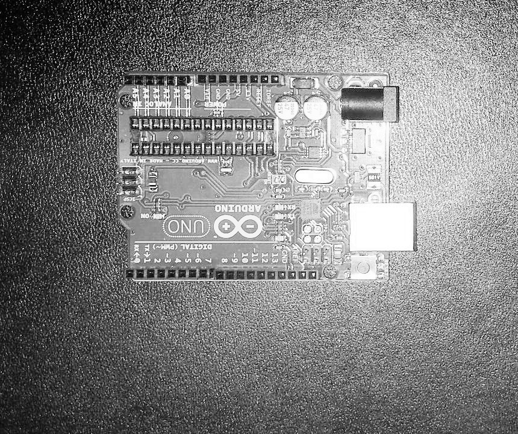
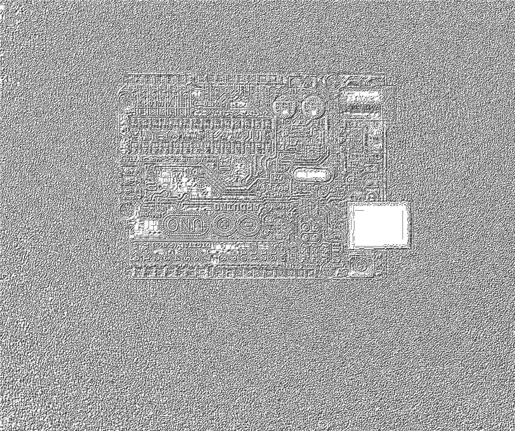
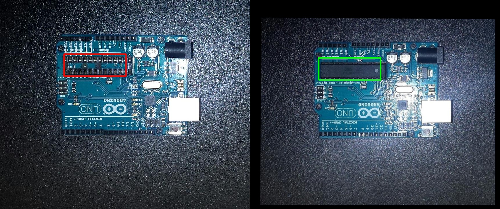

# Week 11
Finishing touches

## Introduction
This last blog is going to contains the last minute changes made to the project. Besides small tweaks, the `getMask()` function and normalisation methods were changed.

## Finding the mask
The original `getMask()` was dilating and eroding the unmatched keypoints from the feature detector. The new function uses template matching to check if the unmatches keypoints are found in the other image. If there are found they get removed from the mask, otherwise they are enhanced. This operation is performed until the contour number stabilises.

```python
def getMask(img1, img2):
    img1Height, img1Width = img1.shape[:2]

    img1 = cv2.equalizeHist(img1)
    img2 = cv2.equalizeHist(img2)

    (img1Dif, img2Dif) = getDifferences(img1, img2)

    mask = np.zeros((img1Height, img1Width, 1), np.uint8)
    mask[:, :] = 0
    for dif in img1Dif:
        mask[int(dif['y']), int(dif['x'])] = 255

    lastNoContours = len(img1Dif)

    shape = cv2.getStructuringElement(shape = cv2.MORPH_RECT, ksize = (5, 5))
    mask = cv2.dilate(src = mask, kernel = shape)

    for i in range(100):
        _, contours, _ = cv2.findContours(image = mask.copy(), mode = cv2.RETR_EXTERNAL, method = cv2.CHAIN_APPROX_NONE)

        for contour in contours:
            x, y, w, h = cv2.boundingRect(points = contour)

            patch = img1[y : y + h, x : x + w]
            (_, value) = getBestMatch(img2, patch)

            if value > 0.5:
                cv2.drawContours(mask, contour, -1, 0)
            else:
                cv2.drawContours(mask, contour, -1, 255, 3)

        noContours = len(contours)
        if noContours / lastNoContours < 0.1:
            lastNoContours = noContours
        else:
            break;

    return mask
```

## Changing the normalisation methods
Before the CLAHE normalisation was used for all the project's operations. Now the rotation, scaling and translation are applied on the original images. The feature detection is then used on images normalised with `cv2.equaliseHist()`. This normalisation method works better for feature detection as it distributes the intensity [1]. This way feature detection doesn't find differences in areas with different lighting. Finally, the CLAHE normalised images were used for the template matching function which eliminates the false-positives patches found in the previous step.

| Equalise Histogram | CLAHE |
| :---: | :---: |
|  |  |


## Final Result
The following image contains the differences between `pcb1.jpg` and `pcb2.jpg`, found using the difference checker algorithm.

| Differences |
| :---: |
|  |

## References
[1] R.C.Gonzalez and R.E.Woods, 'Digital Image Processing', Third Edition, Pearson Education International, 2007, 142-160.
