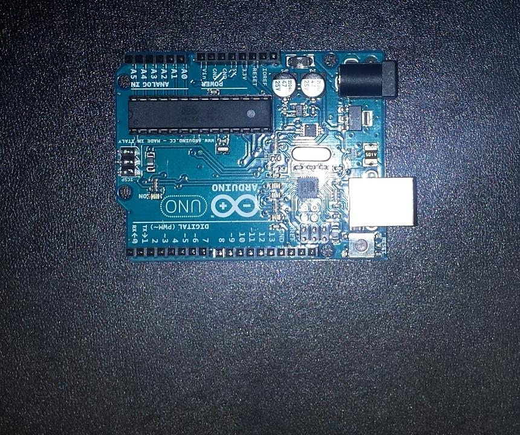

# Week 2
Meeting the team members

The project that my team will do is the one where two images are compared and the objective is to spot the differences. For now the team only has two members, me and Cristian Anton. Next week we will manually try to find the differences in the images so we know the differences that the project should spot.

| First Image | Second Image |
| :---: | :---: |
|  |  |
