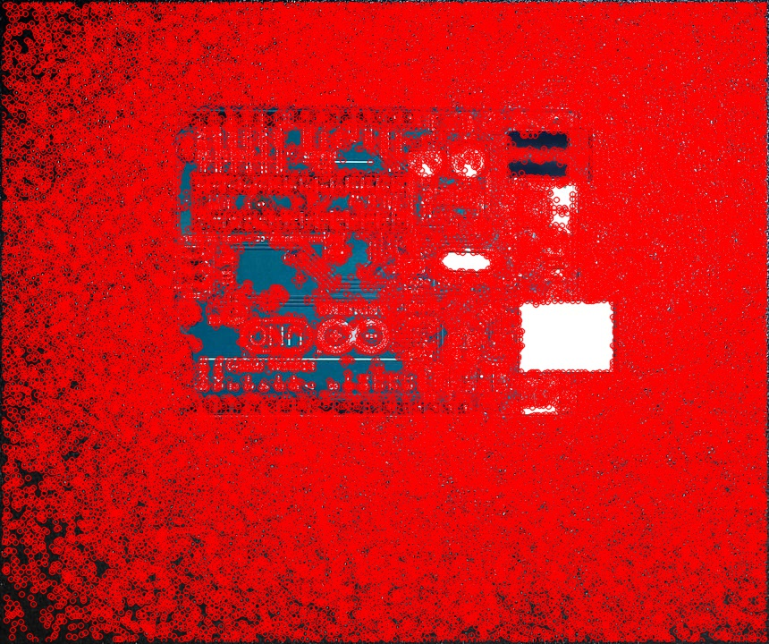
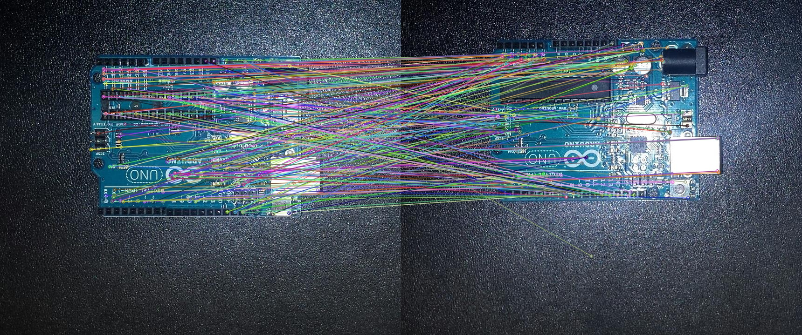
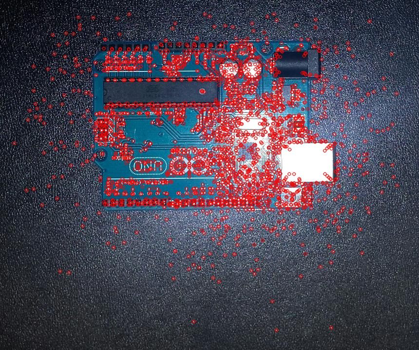

# Week 4
Comparing different feature detection algorithms

## FAST - Features from Accelerated Segment Test [1]

### Keypoints Detection
This is the FAST feature detection algorithm with the Non-Maximum Suppression turned on. FAST works by comparing each pixel with it's neighbours to detect corners. This algorithms will probably not be used because the FAST object in the feature2d module cannot create a descriptor for images.

| PCB1 | PCB2 |
| :---: | :---: |
|  |  |

### Code
```python
def displayFAST(window, image, nms=1):
    fast = cv2.FastFeatureDetector_create()
    fast.setNonmaxSuppression(nms)

    keyPoints = fast.detect(image, None)
    corners = image.copy()
    corners = cv2.drawKeypoints(image = image, keypoints = keyPoints, outImage = corners, color = (0, 0, 255))

    cv2.imwrite('fast.jpg', corners)
    cv2.imshow(window, corners)
```

## ORB - Oriented FAST and Rotated BRIEF [2]

### KeyPoints Detection
This is a feature detection algorithm created by the developers of opencv. It provides similar features to other patented feature detection algorithms such as SURF or SIFT. 

| PCB1 | PCB2 |
| :---: | :---: |
|  |  |

### Code
```python
def displayORB(window, image):
    orb = cv2.ORB_create()

    keyPoints = orb.detect(image, None)
    keyPoints, descriptor = orb.compute(image, keyPoints)
    newImage = image.copy()
    newImage = cv2.drawKeypoints(image = image, keypoints = keyPoints, outImage = newImage, color = (0, 0, 255), flags = 0)

    cv2.imwrite('orb.jpg', newImage)
    cv2.imshow(window, newImage)
```

### Feature Matching
While it doesn't find as many key features in the images, when combined with a Brute-Force Matching algorithm such as BFMatcher it finds many common features.

| Common Features using ORB and BFMatcher |
| :---: |
|  |

### Code
```python
def showCommon(window, image1, keyPoints1, desc1, image2, keyPoints2, desc2):
    bf = cv2.BFMatcher(cv2.NORM_HAMMING, crossCheck = True)
    matches = bf.match(desc1, desc2)
    matches = sorted(matches, key = lambda x:x.distance)
    matchesImage = image1.copy()
    matchesImage = cv2.drawMatches(img1 = image1, keypoints1 = keyPoints1, img2 = image2, keypoints2 = keyPoints2, matches1to2 = matches[:250], outImg = matchesImage, flags=2)

    cv2.imwrite(orbFeatures.jpg, matchesImage)
    cv2.imshow(window, matchesImage)
    
orb = cv2.ORB_create()
keyPoints1, desc1 = orb.detectAndCompute(I1, None)
keyPoints2, desc2 = orb.detectAndCompute(I2, None)
showCommon('orbFeatures', I1, keyPoints1, desc1, I2, keyPoints2, desc2)
```

## AKAZE [3]

### Keypoints Detection
This is another algorithm for detecting common features. It uses a homography matrix to detect local features.

| PCB1 | PCB2 |
| :---: | :---: |
|  |  |

### Code
```python
def displayAKAZE(window, image):
    akaze = cv2.AKAZE_create()

    keyPoints = akaze.detect(image, None)
    newImage = image.copy()
    newImage = cv2.drawKeypoints(image = image, keypoints = keyPoints, outImage = newImage, color = (0, 0, 255), flags = 0)

    cv2.imwrite('akaze.jpg', newImage)
    cv2.imshow(window, newImage)
```

By comparing the images using the BFMatching algorithm the folowing similarities are found.

| Common Features using AKAZE and BFMatcher |
| :---: |
|  |

### Code
```python
def showCommon(window, image1, keyPoints1, desc1, image2, keyPoints2, desc2):
    bf = cv2.BFMatcher(cv2.NORM_HAMMING, crossCheck = True)
    matches = bf.match(desc1, desc2)
    matches = sorted(matches, key = lambda x:x.distance)
    matchesImage = image1.copy()
    matchesImage = cv2.drawMatches(img1 = image1, keypoints1 = keyPoints1, img2 = image2, keypoints2 = keyPoints2, matches1to2 = matches[:250], outImg = matchesImage, flags=2)

    cv2.imwrite('akazeFeatures.jpg', matchesImage)
    cv2.imshow(window, matchesImage)

akaze = cv2.AKAZE_create()
keyPoints1, desc1 = akaze.detectAndCompute(I1, None)
keyPoints2, desc2 = akaze.detectAndCompute(I2, None)
showCommon('akazeFeatures', I1, keyPoints1, desc1, I2, keyPoints2, desc2)
```


## References:
[1] 'FAST Algorithm for Corner Detection', 2014, [Online]. Available: http://docs.opencv.org/3.0-beta/doc/py_tutorials/py_feature2d/py_fast/py_fast.html. [Accessed: 2017-10-05]

[2] 'ORB (Oriented FAST and Rotated BRIEF)', 2014, [Online]. Available: http://docs.opencv.org/3.0-beta/doc/py_tutorials/py_feature2d/py_orb/py_orb.html#orb. [Accessed: 2017-10-05]

[3] 'AKAZE local features matching', 2014, [Online]. Available: http://docs.opencv.org/3.0-beta/doc/tutorials/features2d/akaze_matching/akaze_matching.html. [Accessed: 2017-10-05]
