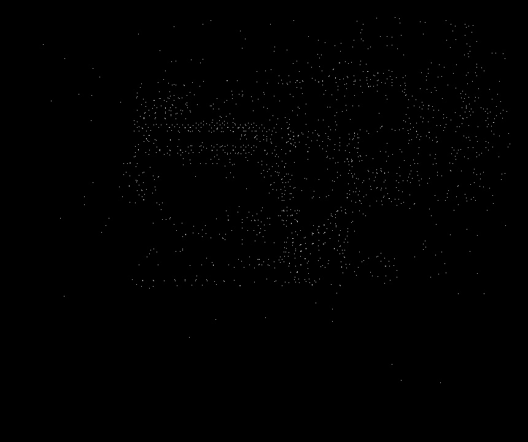

# Week 6
Finding unmatched features

## Introduction
The research from the past two weeks have shown that the best way to find the common features between two images is to use AKAZE as the Feature Detection algorithm and Brute-Force Matching with NORM_HAMMING and Cross Checking enabled. This week's blog will show the first steps in finding the differences between images.

## Step 1: Extracting the different features
For this step, a list will be generated for each image containing only the keypoints that were not matched by the Brute-Force Matching algorithm. This will result in potential features that could be different. This part works by extracting the keypoints and descriptors for each image. Using Brute-Force Matching, the matches from the descriptors. After this a list is created for each image that contains the coordinates of each feature that wasn't matched.

### Code
```python
def getDifferences(img1, img2):
    # Detect and Compute keypoints and descriptors for each image
    akaze = cv2.AKAZE_create()
    kp1, desc1 = akaze.detectAndCompute(img1, None)
    kp2, desc2 = akaze.detectAndCompute(img2, None)

    # Get a list of all matches
    bf = cv2.BFMatcher(normType = cv2.NORM_HAMMING, crossCheck = True)
    matches = bf.match(desc1, desc2)

    # Mark keypoints that were matched previously
    for match in matches:
        kp1[match.queryIdx] = None
        kp2[match.trainIdx] = None

    # Create a list that contains the coordinate of the keypoints for the first image
    differences1 = []
    for keyPoint in kp1:
        if keyPoint != None:
            currentKP = {
                'x': keyPoint.pt[0],
                'y': keyPoint.pt[1]
            }
            differences1.append(currentKP)
            
    # Create a list that contains the coordinate of the keypoints for the second image
    differences2 = []
    for keyPoint in kp2:
        if keyPoint != None:
            currentKP = {
                'x': keyPoint.pt[0],
                'y': keyPoint.pt[1]
            }
            differences2.append(currentKP)

    return (differences1, differences2)
```

## Step 2: Creating a mask from the unmatched features
Here, a blank mask is generated with the size of the image. After that for each coordinate of the unmatched feature a white pixel is drawn. In the following code, a mask is created for the first image.

### Code
```python
img1Size = pcb1.shape

(img1Dif, img2Dif) = getDifferences(pcb1, pcb2)

mask = np.zeros((img1Size[0], img1Size[1], 1), np.uint8)
mask[:, :] = 0
for dif in img1Dif:
    mask[dif['y'], dif['x']] = 255
```

### Result

| PCB1 | MASK |
| :---: | :---: |
|  |  |

## Step 3: Closing the mask
To generate regions of interest, the mask is closed using the morphology tool. By dilating and then eroding the mask, pixels that are close are merged while maintaining distinct areas. The following code shows the shape type and size used.

### Code
```python
shape = cv2.getStructuringElement(cv2.MORPH_RECT, (10, 10))
mask = cv2.morphologyEx(mask, cv2.MORPH_CLOSE, shape)
```

### Result

| Original Mask | Closed Mask |
| :---: | :---: |
|  |  |

## Step 4: Finding contours
After closing the image there can be found several areas that contain differences. Using the `cv2.findContours()` function, the contours of the areas are extracted and boundary rectangle is displayed around them. To do this, the corners are approximated using the perimeter of the contour (`cv2.arcLength`). For a better approximation of the corners, the perimeter has to be multiplied by a value. The OpenCV recommend using 1% of the perimeter for a better approximation [1]. After this a boundary rectangle is drawn around the contour.

### Code
```python
_, contours, _ = cv2.findContours(image = mask.copy(), mode = cv2.RETR_TREE, method = cv2.CHAIN_APPROX_NONE)
for contour in contours:
    arcPercentage = 0.01
    epsilon = cv2.arcLength(curve = contour, closed = True) * arcPercentage
    corners = cv2.approxPolyDP(curve = contour, epsilon = epsilon, closed = True)
    x, y, w, h = cv2.boundingRect(points = corners)
    currentArea = w * h

    # Ignore points
    if currentArea > 1:
        cv2.rectangle(pcb1, (x, y), (x + w, y + h), (0, 0, 255), 3)
```

### Result

| Differences in PCB1 |
| :---: |
|  |

## Conclusion
As can be seen in the last image, there are many areas that don't contain differences. To further filter these areas, template matching can be used to find if each of the patches are found or not in the other image. This works by sliding the patch over the image and calculating how similar it is to that area of the image [2]. If there isn't a good enough match, then that area is considered to be containing a difference. This will be further explored in a future blog post.

## References
[1] OpenCV, 'Contour Approximation', 2015, [Online]. Available: http://docs.opencv.org/3.1.0/dd/d49/tutorial_py_contour_features.html. [Accessed: 2017-10-21].

[2] OpenCV, 'Template Matching', 2017, [Online]. Available: https://docs.opencv.org/2.4/doc/tutorials/imgproc/histograms/template_matching/template_matching.html. [Accessed: 2017-10-21]
