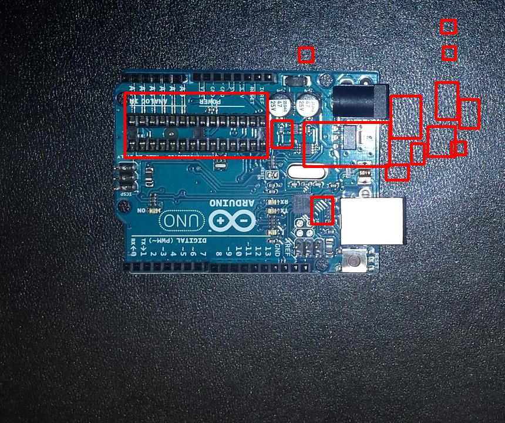
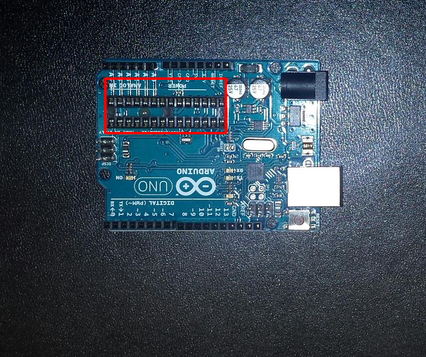

# Week 8
Testing Threshold Template Matching

## Introduction
This week's blog post will cover the testing done on the differences found in Week 6.
This should only get the patches that contains differences.

## Code
The first function `getBestMatch()` finds the best matching patch from the second image.
It returns the coordinates of the patch the match value (between 0 and 1).
The second function `getBestPatches()` searches through the list of patches found in Week 6
and returns all the patches that have a match value (from `getBestMatch()`) lower than a
theshold [1].

```python
def getBestMatch(img, patch):
    patchSize = patch.shape

    gImg = cv2.cvtColor(img, cv2.COLOR_BGR2GRAY)
    gPatch = cv2.cvtColor(patch, cv2.COLOR_BGR2GRAY)

    # cv2.TM_CCOEFF_NORMED or cv2.TM_CCORR_NORMED
    result = cv2.matchTemplate(image = gImg, templ = gPatch, method = cv2.TM_CCOEFF_NORMED)

    (_, value, _, (x, y)) = cv2.minMaxLoc(result)

    return ((x, y), value)

def getBestPatches(sourceImg, checkImg, patches, threshold = 0.5):
    bestPatches = []
    for (x, y, w, h) in patches:
        patch = sourceImg[y : y + h, x : x + w]
        ((mX, mY), matchValue) = getBestMatch(checkImg, patch)
        if matchValue < threshold:
            bestPatches.append((x, y, w, h))

    return bestPatches
```

## cv2.TM_CCOEFF_NORMED
These are the differences found between `pcb1.jpg` and `pcb2.jpg` using cv2.TM_CCOEFF_NORMED
with a threshold of 0.35.

| cv2.TM_CCOEFF_NORMED - 0.35 |
| :---: |
|  |

## cv2.TM_CCORR_NORMED
These are the differences found between `pcb1.jpg` and `pcb2.jpg` using cv2.TM_CCORR_NORMED
with a threshold of 0.8

| cv2.TM_CCORR_NORMED - 0.8 |
| :---: |
|  |

## Conclusion
In the results above, `cv2.TM_CCORR_NORMED` provided the best results. The other method
detected more patches as being different. To solve this issue, the images should be normalised
to look as similar possible. This could be achieved by finding the edges of the images and
only using those to find different features. This will be futher explored in a future blog post.

## References
[1] OpenCV 3.3.1 Tutorials, 2017, [Online]. Available: https://docs.opencv.org/trunk/d4/dc6/tutorial_py_template_matching.html.
[Accessed: 2017-11-04]
