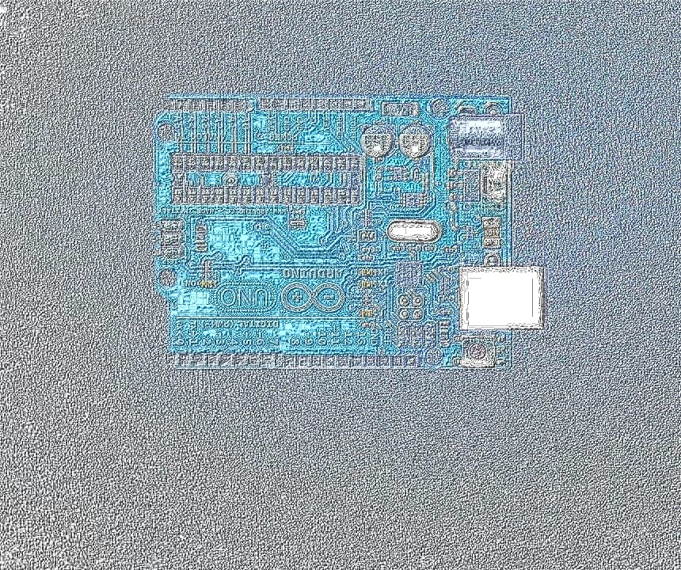
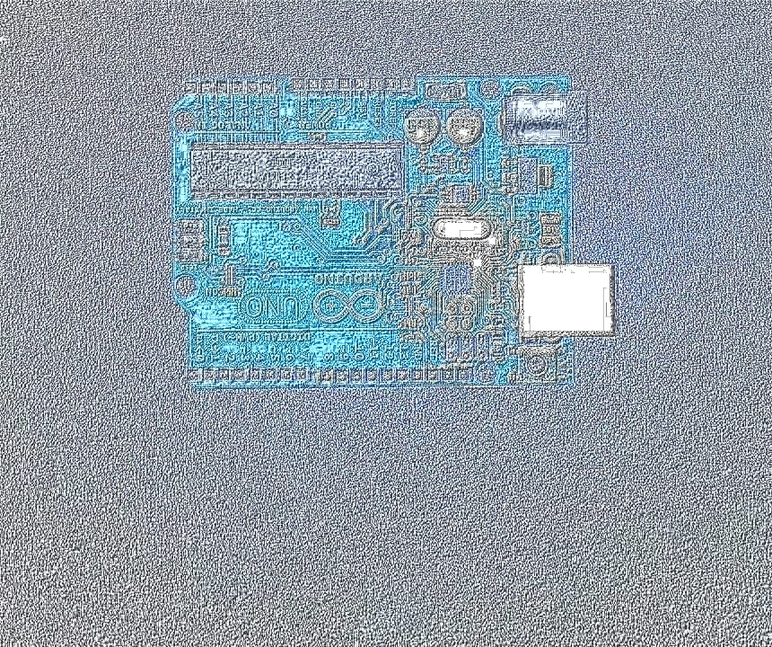
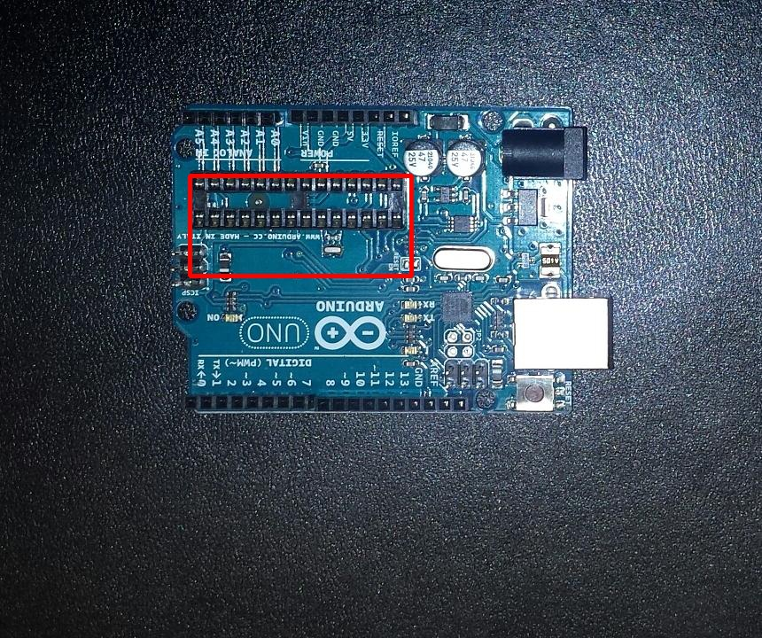

# Week 9
Improving the results

## Introduction
This post will cover the improvements done to the image in order to get better
matches between them. It will also cover some code improvement.

## Normalisation
Following Cristian's findings, the images were normalised using CLHE
(Contrast Limited Histogram Equalization). This is just a version of CLARHE
(Contrast Limited Adaptive Histogram Equalization) that uses the whole images
instead of patches [1]. It is already implemented in OpenCV. This has removed the
shining lights from the images.

### Code
```python
def normaliseImg(img):
    height, width = np.shape(img)[:2]
    clahe = cv2.createCLAHE(clipLimit = 4, tileGridSize = (height, width))

    yuv = cv2.cvtColor(img, cv2.COLOR_BGR2YUV)
    luminance = yuv[:, :, 0]
    yuv[:, :, 0] = clahe.apply(luminance)

    return cv2.cvtColor(yuv, cv2.COLOR_YUV2BGR)
```

### Results

| Norm PCB1 | Norm PCB2 |
| :---: | :---: |
|  |   |


## Lowest Template Matching Value
In last week's blog template matching was used to eliminate false differences found
using feature matching. The normalised values of the template matching algorithms
return a value between 0 (different image) to 1 (same image). This new function
loops through some of the possible values from 0 to 1 to find the lowest threshold
where differences were found. This way the threshold does not have be manually set.

### Code
```python
def getBestPatchesAuto(sourceImg, checkImg, patches):
    for th in range(10):
        threshold = th / 10.0
        bestPatches = getBestPatches(normPCB1, normPCB2, patches, threshold)
        if len(bestPatches) > 0:
            return bestPatches
    return bestPatches
```

## Morphological Transformations
The mask of the differences was changed slightly to provide a more universal
method of combining the different pixels.

```python
shape = cv2.getStructuringElement(cv2.MORPH_RECT, (3, 3))
mask = cv2.dilate(mask, shape, iterations = 10)
shape = cv2.getStructuringElement(cv2.MORPH_RECT, (3, 3))
mask = cv2.erode(mask, shape, iterations = 20)
```

## Rotating Images
As the template matching algorithm is sensitive to rotation and scaling, the
two images need to have the same orientation. As the rotation angle can be found
from the feature detection algorithm the only step necessary is to rotate them.
More information can be found on Emmet's blog posts [2], [3].

## Results from the improvements
While the surrounding rectangle is still not perfect, it contains a smaller
rectangle than before.

| Differences |
| :---: |
|  |

## Conclusion
This week's blog concentrated on improving the algorithm so it can be used for other
images as well. It has also slightly improved on the test images.

## References
[1] N.M. Sasi, V.K. Jayasree, Contrast Limited Adaptive Histogram Equalization for
Qualitative Enhancement of Myocardial Perfusion Images, 2013, Scientific Research Publishing,
p. 327

[2] E.Doyle, Rotating the Image, 2017, [Online].
Available: https://vzat.github.io/comparing_images/emmet/rotating_the_image.html.
[Accessed: 2017-11-11].

[2] E.Doyle, Adding and Removing Borders, 2017, [Online].
Available: https://vzat.github.io/comparing_images/emmet/adding_and_removing_borders.html.
[Accessed: 2017-11-11].
